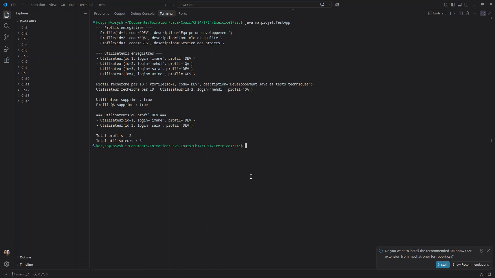

# TP14 Java

Exercice sur une architecture en couches avec DAO generique.

## Exercice

1. [Gestion des profils et des utilisateurs](Exercice1/)

## Demonstration

[Video de demonstration](Screen/video/TP14-demonstration.mp4)
